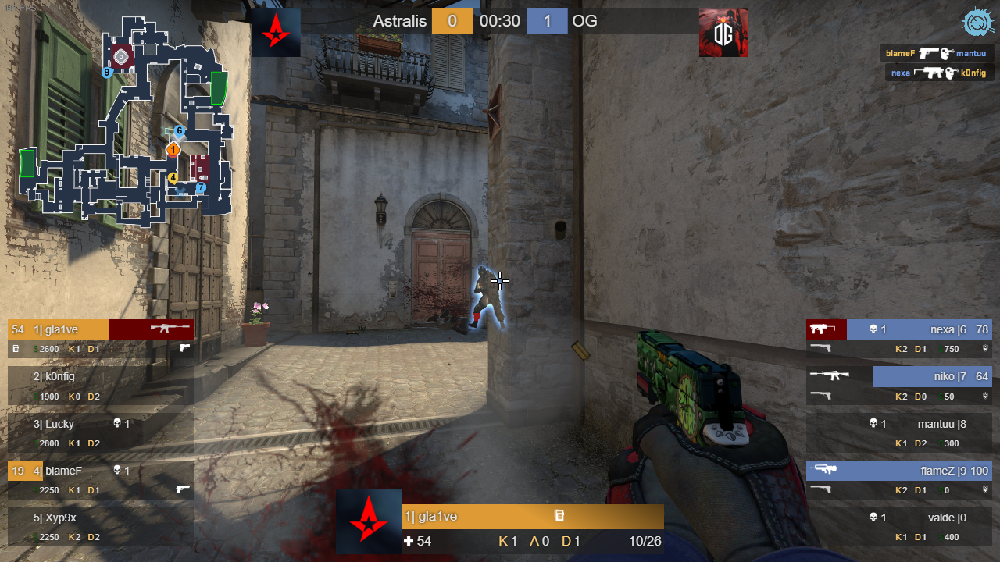

# bwmhud - The HUD used for the Wingman Tournament by BreS:GO

## Background
This hud is designed for all the CS:GO casters that are desperately looking for **free** a custom spectator hud. I created this hud in my free time and I want to share it with you. It is equipped with an MIT license so that you can use and modify it in any way you want.

Please consider that I am not a web developer and therefore the code is most probably garbage. Nevertheless, it works, so it is good enough for me. If you feel like something could be implemented smarter, please let me know and I will take it in consideration.

## Installation and Usage
- Install [node.js](https://nodejs.org/en/)
- Download this project, either by cloning it or just by downloading the zip folder. The latter has to be unpacked then, of course.
- Copy the file *gamestate_integration_nshud.cfg* into the config folder of CS:GO. It is usually located at:
> C:\Program Files (x86)\Steam\steamapps\common\Counter-Strike Global Offensive\csgo\cfg 

See [CS:GO Game State Integration](https://developer.valvesoftware.com/wiki/Counter-Strike:_Global_Offensive_Game_State_Integration) for more information on how this works.
- Open *PowerShell* or whatever command line tool you are comfortable with and navigate to the project
- Run `npm install`
- Run `npm start`

The hud runs now as a website at [http://localhost:8000](http://localhost:8000).

### Telnet
The CS:GO console can be accessed with the telnet protocol. You need to add the following to your CS:GO Launch Options:
```
-netconport 2121
```
Additionally, in *config.json* the `use_telnet` option has to be true.
The hud uses the console access to read ingame chat messages and display them in the hud. Furthermore, any console command can be triggered by the hud. 

The hud can therefore trigger some camera transitions in CS:GO. They are implemented in `spec.html`. For using them, open the website [http://localhost:8000/spec](http://localhost:8000/spec). Press the desired camera transition. Be aware that `random` triggers multiple, one after another.
**When going back to spectating players, one should always press the `reset` button first.** This resets the `spec_mode` and stops the random camera transitions from triggering new transitions every few seconds.

## Config & Team Info
There are two important files for customization. One is the config file with some basic settings. The other is the team info. Here, you can enter the names of the teams playing and add team icons.

### Steam Web API Key
For showing the player avatars you have to request a Steam Web API Key. More information on the Steam Web API can be found [here](https://steamcommunity.com/dev). You can request a new key by filling out [this form](https://steamcommunity.com/dev/apikey). 

**Please be aware that are these keys are abused by scammers to send you fake trade offers! Do not share this key with anyone and if you don't need it anymore, delete the key!**

Unfortunately, for displaying the player avatars you need to get one of these keys. When you have it, add it to *config.json* and set the `show_player_avatars` option to true:
```
"show_player_avatars": true,
"steam_api_key": "XXXXXXXXXXXXXXXXXXXXXXXXXXXXXXXX"
```

## Radar
I use the [boltobserv](https://github.com/boltgolt/boltobserv) radar and added my config to this repository.

# Setup for Cast
I use OBS for casting. The hud and radar are added as browser sources. For setting up CS:GO I use the *caston.cfg*/*castoff.cfg* configs that basically just turn the CS:GO hud on and off.

If you have any questions regarding the OBS setup, please let me know.
